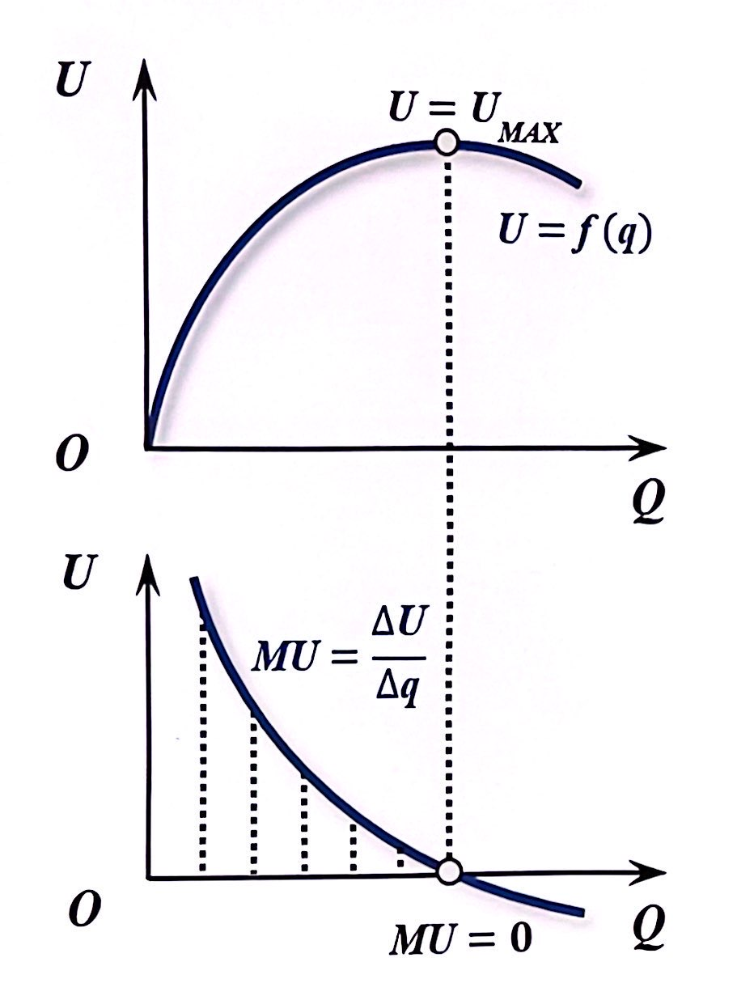
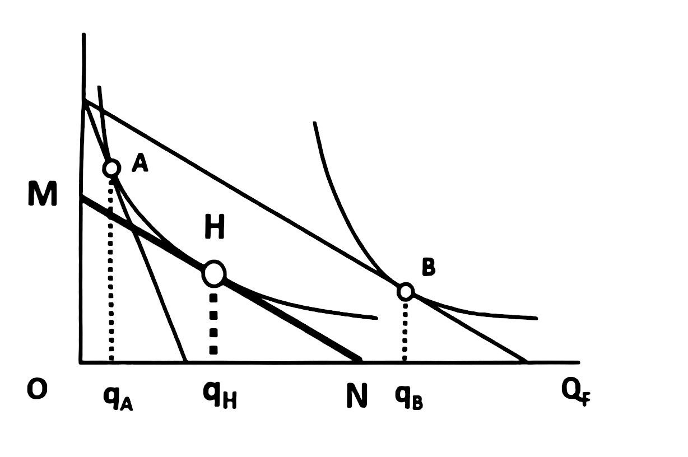
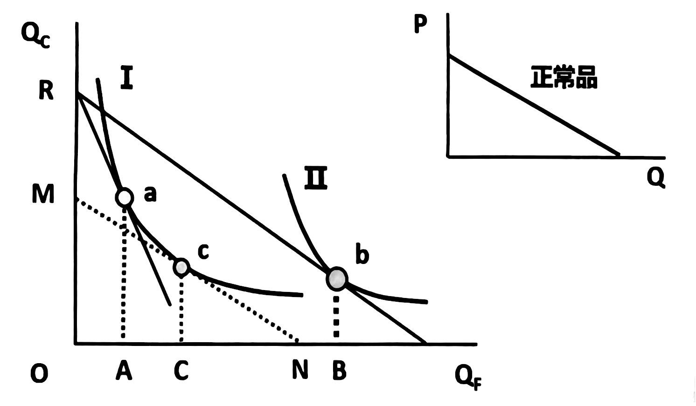
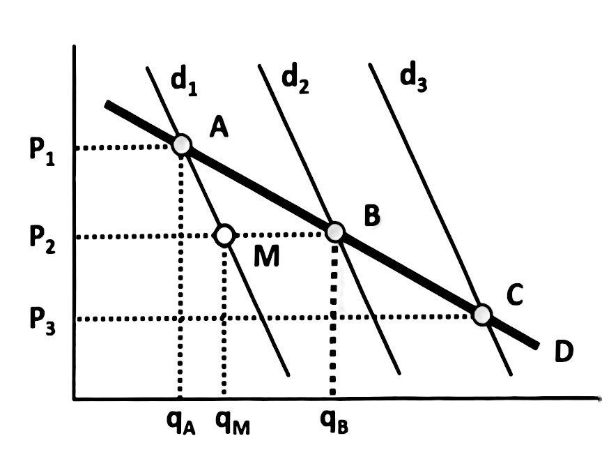
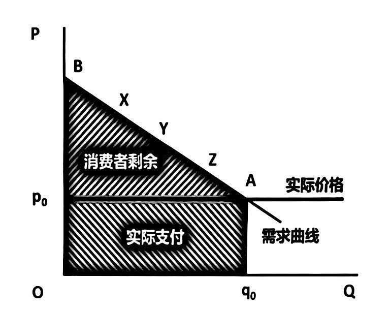

# 第三章 消费选择与需求曲线

* $\S$ 3.1 基数效用与需求曲线

* $\S$ 3.2 消费偏好与消费选择

* $\S$ 3.3 需求曲线的决定、变动及形状

* $\S$ 3.4 需求曲线与消费福利

[TOC]

# $\S$ 3.1 基数效用与需求曲线

### 一、效用与边际效用

* **效用**：消费者通过配置资源得到最大程度满足的行为

  * 效用函数反映效用数量与消费数量之间的关系

    $U = f(q)$   $U_1 = f(q_1)$  $U_2 = f(q_2)$  

  * 总效用是指消费一定数量产品所得到的效用量总和

    $TU = f(q_1, q_2) = U_{q_1} + U_{q_2}$  $TU = f(x_1, x_2) = U_{x_1} + U_{x_2}$

* **边际效用**：边际效用是增加单位产品消费得到的效用增量
  $$
  & MU = \frac{\Delta U}{\Delta q}\\
  & MU = \frac{\partial U}{\partial q}\\
  $$

  * 边际效用递减：其他条件不变是，随某种产品消费量的增加，消费者从该产品消费中得到的边际作用递减

### 二、效用最大化条件

* 消费一种产品（不考虑收入）

  * 消费者均衡条件：边际效用为0

  $$
  \begin{flalign*}
  & \left \{ 
      \begin{aligned} 
         & P = 0\\
         & MU = 0, U = U_{max}
      \end{aligned} 
    \right.
  \end{flalign*}
  $$

* 消费一种产品（收入约束下）

  * 消费者均衡条件：消费产品的边际效用等于单位货币支出的边际效用

  $$
  \begin{flalign*}
  & \left \{ 
      \begin{aligned} 
         & P\cdot Q = m\\
         & \frac{MU}{P} = \lambda
      \end{aligned} 
    \right.
  \end{flalign*}
  $$

* 消费多种产品（收入约束下）

  * 消费者均衡条件：消费产品的边际效用等于单位货币支出的边际效用

  $$
  \begin{flalign*}
  & \left \{ 
      \begin{aligned} 
         & P_1 \cdot Q_1 + P_2 \cdot Q_2 = m\\
         & \frac{MU_1}{P_1} + \frac{MU_2}{P_2}= \lambda
      \end{aligned} 
    \right.
  \end{flalign*}
  $$

* **需求定理**：其他条件不变时，产品需求量与价格反向变动
  * **需求曲线**：绝对向右下方倾斜 $P = \frac{1}{\lambda} \cdot MU(Q)$
  * **线上的点**：消费者效用最大化的价格-数量组合

# $\S$ 3.2 消费偏好与消费选择

### 一、消费偏好

#### 1. 偏好描述

* **产品组合**：消费者选择的对象称为产品组合，全部产品组合的集合称为产品空间。
* **消费偏好**：消费者对任意两个产品组合给出的排序即是消费偏好，假设消费排序遵从偏好公理。
* **无差异线（几何描述）**：描述消费偏好的一种工具，是使消费者获得同等效用水平的产品组合的集合。
* **效用函数（代数描述）**：表示产品组合对消费者提供的效用水平
  * $U = f(x_1, x_2)$

* **偏好公理**
  * **偏好的完备性公理**：对消费集$X$中的任意的 $x$ 和 $y$，$x \ge y$与$x \le y$至少有一个成立
  * **偏好的传递性公理**：对消费集$X$中的任意的$x$，$y$ 和 $z$，如果$x \ge y$， $y \ge z$，则$x \ge z$
  * **局部非饱和性公理**：给定消费集$X$中的任意的 $x$ 以及任意 $\varepsilon > 0$，在$X$中总存在产品组合 $y$，满足 $\left| x - y\right| < \varepsilon$ 使得 $y > x$

#### 2. 无差异线

* **无差异线**：消费者获得同等**效用水平**的产品组合的集合
  * $U = f(x_1,x_2)$
  * **柯布·道格拉斯函数**：$u(x_1,x_2) = x^{\alpha}_1 \cdot x^{\beta}_2$ 

* **边际替代率**：无差异线斜率，反映同等效用水平下，增加一单位产品 $X_1$ 消费所愿意放弃的另一产品 $X_2$ 的数量
  $$
  \begin{flalign*}
  	MRS_{12} &= -\frac{\Delta x_2}{\Delta x_1}\\
  	MRS_{12} &= -\frac{dx_2}{d{x_1}}\\ 
  	MRS_{12} &= -\frac{MU_1}{MU_2}\\
  \end{flalign*}
  $$

* **边际替代率递减**：同等效用水平下，随着一种产品消费量的增加，其单位产品替代的另一产品的数量将不断减少

#### 3. 无差异线形状

* 完全替代偏好：$U = ax_1 + bx_2$
* 完全互补偏好：$U = min \left\{ x_1, x_2 \right\}$
* 补充：

* 柯布·道格拉斯偏好

### 二、预算约束

* **预算方程**：$p_1 x_1 + p_2 x_2 = m$
* **预算线**：是全部支出等于全部收入的产品组合的集合
  * $x_2 = -\frac{p_1}{p_2} x_1 + m$
  * $m$ 发生变化时，预算线平移
  * $p_1$ 发生变动时，预算线旋转

### 三、消费者均衡

* **消费者均衡**：消费者不愿意表懂任何消费数量的稳定状态，即效用最大化状态
* **需求**：一定时期内，各种可能价格下，消费者愿意且能够购买的产品数量

* 消费意愿：效用函数和无差异线
* 支付能力：预算方程和预算线
* 需要求解：怎样选择才能效用最大

#### 1. 消费者均衡的几何解

* 消费者均衡位于无差异线与预算的切点

  * 无差异线斜率即边际替代率：$-\frac{\Delta x_2}{\Delta x_1}\\$
  * 预算线斜率时两产品价格比：$-\frac{p_1}{p_2}\\$

* 消费者均衡条件：边际替代率等于预算线斜率

  
  $$
  \begin{flalign*}
  & \because  MRS_{12} = -\frac{\Delta x_2}{\Delta x_1} = -\frac{p_1}{p_2} \quad MRS_{12} = \frac{MU_1}{MU_2}\\
  & \therefore \frac{MU_1}{p_1} = \frac{MU_2}{p_2}
  \end{flalign*}
  $$

#### 2. 消费者均衡的代数解

* 效用最大化的一阶条件
  $$
  \begin{flalign*}
  & \begin{aligned}
  	%line1
  	\begin{cases} 
  		 \max_x \quad & u(x_1,x_2) \\
  		 s.t. \quad & p_1x_1 + p_2x_2 = m\\
  	\end{cases} 
  
  	\qquad \qquad & => \quad 
  	
  	\max_{x_1} \quad u \left( x_1, (\frac{m}{p_2} - \frac{p_1}{p_2}x_1) \right) \\
  	
  	%line2
  	令F(x_1) = u \left( x_1, (\frac{m}{p_2} - \frac{p_1}{p_2}x_1) \right) \quad & => \quad \frac{dF(x_1)}{dx_1} = 0\\
  	
  	%line3
  	\frac{dF(x_1)}{dx_1} = \frac{\partial u}{\partial x_1} - \frac{p_1}{p_2} \cdot \frac{\partial u}{\partial x_2} = 0 \quad & => \quad \frac{\partial u / \partial x_1}{\partial u / \partial x_2} = \frac{p_1}{p_2}
  \end{aligned}
  \\
  \\
  & 即：p_1 / p_2 = u_1 / u_2 = MU_1 / MU_2
  \end{flalign*}
  $$

* 效用最大化的二阶条件
  $$
  \begin{flalign*}
  \begin{aligned}
  	%line1
   	& 对于F(x_1) = u \left( x_1,\frac{m}{p_2} - \frac{p_1}{p_2} x_1 \right), 最大二阶条件要求\frac{d^2F(x_1)}{dx^2_1} < 0\\
  	
  	%line2
  	& \frac{d^2F(x_1)}{dz^2_1} = \frac{\partial^2 u}{\partial x^2_1} - \frac{p_1}{p_2} \cdot \frac{\partial^2 u}{\partial x_1 \partial x_2} - \frac{p_1}{p_2} \cdot \left( \frac{\partial^2 u}{\partial x_1 \partial x_2} - \frac{p_1}{p_2} \cdot \frac{\partial^2 u}{\partial x^2_2} \right) < 0\\
  	
  	%line3
  	& -p_2^2u_{11} + 2p_1p_2u_{12} - p_1^2u_{22} > 0 
  	
  	\qquad <=> \qquad
  	
  	\begin{vmatrix}
      u_{11} & u_{12} & -p_1 \\
      u_{12} & u_{22} & -p_2 \\
      -p_1   & -p_2    & 0    \\
    \end{vmatrix}
  	>0
  
  \end{aligned}
  \end{flalign*}
  $$

* 效用最大化的充要条件
  $$
  \begin{flalign*}
  \begin{aligned}
  \textbf{一阶条件} \qquad & p_1 / p_2 = u_1 / u_2\\\\
  \textbf{二阶条件} \qquad & -p_2^2u_{11} + 2p_1p_2u_{12} - p_1^2u_{22} > 0\\\\
  \textbf{充要条件} \qquad & u_{11}u_2^2 - 2u_1u_2u_{12} + u_1^2u_{22} < 0\\\\
  \end{aligned}
  \end{flalign*}
  $$

* 例子
  $$
  \begin{flalign*}
  & \textbf{设}:
  函数为u = \left(x_1, x_2\right) = x_1^{\alpha} x_2^{1-\alpha},价格为p_1,p_2,收入为m\\\\
  & \textbf{求}:消费者购买多少X_1, X_2时,其效用最大\\\\
  
  & \textbf{解}:
  \quad L = x_1^{\alpha} x_2^{1-\alpha} + \lambda(m - p_1x_1 - p_2x_2) \\\\ 
  
  & \qquad \begin{cases}
      & \partial L / \partial x_1 = \alpha x_1^{\alpha} x_2^{1-\alpha} - p_1 \lambda = 0 \\\\
      & \partial L / \partial x_2 = (1 - \alpha) x_1^{\alpha} x_2^{1-\alpha} - p_2 \lambda = 0 \\\\
      & \partial L / \partial \lambda = m - p_1x_1 - p_2x_2 = 0 \\
    \end{cases}
  
  \quad => \quad
  
  \quad \begin{cases}
      & x_1 = \frac{\alpha \cdot m}{p_1} \\\\
      & x_2 = \frac{(1 - \alpha) \cdot m}{p_2}
    \end{cases}
  
  \\\\
  
  & \qquad Q = f(p,m) = \frac{\alpha \cdot m}{p} \qquad \color{red}{(马歇尔需求函数)}
  
  \end{flalign*}
  $$

# $\S$ 3.3 需求曲线的决定、变动及形状

### 一、需求曲线的决定

#### 价格-消费曲线 (PCC)

在消费者偏好、收入、其他产品价格不变条件下，某一产品在不同价格水平下，消费者均衡点的集合

* **需求曲线**：消费者均衡点的集合。意味着，每一个需求量都是一定产品价格下，消费者效用最大化的需求量
* 线上的点，反映不同效用的水平。价格越低，效用水平越高

$$
Q = f(p,\overline m) = \frac{\alpha \cdot \overline m}{p}
$$

#### 收入-消费曲线 (ICC)

在消费者偏好、收入、其他产品价格不变条件下，不同收入水平下，消费者均衡点的集合
$$
Q_A = f(\overline p, m) = \frac{\alpha \cdot m}{\overline p}
$$
#### 恩格尔定律

* 食品支出会随收入增长二增加，但其增长速度小于收入增长速度，因此食品支出占收入的比例将随收入增加而下降
* 一个家庭或国家，赋予程度越高，则食品支出的收入弹性越小；反之越大
* 恩格尔曲线表示每一收入水平下消费者对某种产品的需求量

-----

### 二、需求曲线的移动 (略)

-----

### 三、需求曲线的形状

#### 1. 价格效应及其分解

* **价格效应**：一种产品价格变动所引起的该产品需求量变动。
  * **价格效应 = 替代效应 + 收入效应**

* **替代效应**：产品价格变动引起产品相对价格变动，进而由相对价格变动引起的需求量变动
* **收入效应**：产品价格变动引起实际收入变动，进而由世纪收入变动引起的需求量变动

#### 2. 正常品的价格效应 (正常品的需求曲线)

* **替代效应**：$AC > 0$
* **收入效应**：$BC > 0$
* **价格效应**： $AB = AC + BC > 0$

#### 3. 低档品

* **替代效应**：$AC > 0$，随价格反向变动
* **收入效应**：$BC < 0$ ，随价格同向变动 
* **价格效应**： $AB = AC + BC > 0$ 

* 低档品，收入效应小于替代效应，价格效应随价格反向变动##

#### 4. 吉芬品

* **替代效应**：$AC > 0$，随价格反向变动
* **收入效应**：$BC > 0$，随价格同向变动
* **价格效应**： $AB = AC + BC < 0$，随价格同向变动
* 吉芬品，是一种特殊的低档品，收入效应大于替代效应，价格效应随价格同向变动

### 小结：

 

#### 曲线决定：价格变动

消费者偏好、收入，以及其它产品价格不变时，某一产品不同价格下的消费者均衡点，在产品面中构成了价格-消费线。

价格-消费线反映不同价格下效用最大化的需求量，转换到Q-P坐标系中得到需求曲线。因此，需求曲线是消费者均衡点的集合，具有负斜率特征。

#### 曲线变动：收入变动

消费者偏好、产品价格不变时，不同收入下的消费者均衡点，在产品面中构成了收入-消费线。

收入-消费线反映不同收入下的需求量，在Q-P坐标系中可以观察到，每一条需求曲线都是对应特定收入水平的需求曲线，如果收入变化，需求曲线则会平移。

#### 曲线形状：价格效应

价格变动引起该产品需求量的变动称为价格效应，被分解为替代效应和收入效应。

价格效应分解，可以解释正常品、低档品和吉芬品需求曲线的形状，也经常用于分析多种补贴政策的效率。

# $\S$ 3.4 需求曲线与消费福利

### 一、市场需求与网络效应

#### 1. 网络效应

* **市场需求曲线**：个人需求曲线水平加总，具有和个人曲线类似特征，一般向右下方倾斜

  $$
  Q_d(P) = \sum_{i = 1}^n q_i(P) \\
  Q_d(P) = n\cdot q_i(P)
  $$

* **网络效应**：Network Externality, Network Effect 市场需求对个人需求量的影响。如果消费者的个人需求量随市场需求量增加而增加，则为网络正效应；反之为网络负效应

#### 2. 网络正效应

* **网络正效应 (流行效应)**
  * 个人需求量随市场消费量扩大而增加的情形。
  * 网络正效应会导致市场需求曲线比个人需求曲线更富有弹性，通过产品降价，厂商可以获得更大的收入。
  * **例如**，时髦网红的消费，共享单车等平台性质的产品，互补性质的产品，网络性质的产品等等。

#### 3. 网络负效应

* **网络负效应 (逆反效应)**：
  * 个人需求量随市场消费量扩大而减少的情形。
  * 网络负效应会导致市场需求曲线比个人需求曲线更缺乏弹性（市场需求曲线更陡），通过产品提价，厂商可以获得更大的收入。
  * **例如**，网络产品因垃圾、病毒等从大众转向小众（浏览器从IE到Firefox、Safari），大假期间避堵的多种选择，各种限量版、定制版、签名版等特别款产品。

### 二、消费者剩余及其损失

* **消费者剩余**：是指消费者愿意为某一产品支付的货币数量与购买时实际支付的货币数量之间的差额

* 如果 $p = f(q)$，量从 $0 \to q_0$
  $$
  \begin{flalign*}
  
  CS = \int_0^{q_0}f(q)dq - q_0p_0
  \end{flalign*}
  $$

